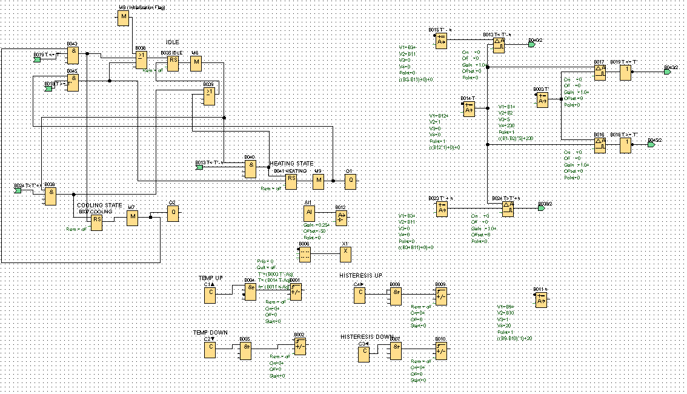
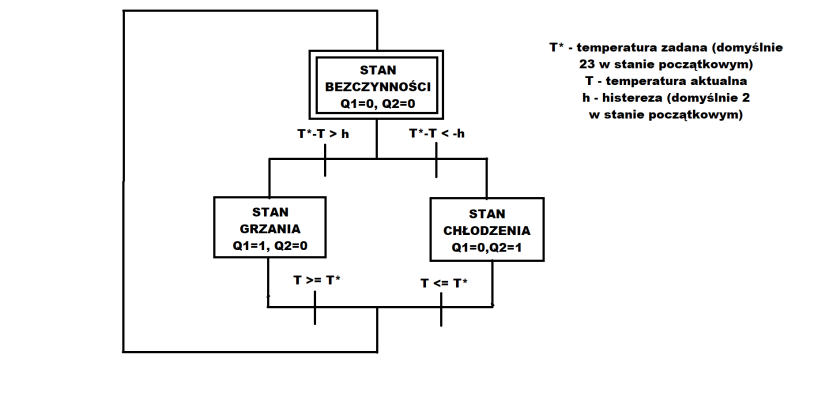

# Podstawy informatyki przemysłowej - projekt nr 5

_grupa: Adam Bednarski, Michał Skibiński, Paweł Lachawiec_

## 1. opis zadania

Problemem do rozwiązania jest problem sterowania temperaturą w zamkniętej przestrzeni.
Za ogrzewanie i ochładzanie temperatury odpowiada żarówka halogenowa umieszczona wewnątrz, oraz
wentylatory umieszczone na przeciwległych ścianach. Temperaturę mierzymy czujnikiem temperatury PT-100.
Urządzenia wyjściowe posiadają 3 stany, w których mogą się znajdować:
1. Stan bezczynności (IDLE) - zarówno żarówka jak i wentylatory są bezczynne
2. Stan grzania - żarówka włączona, wentylatory wyłączone
3. Stan chłodzenia - żarówka wyłączona, wentylatory włączone

Zasady działania:
T* - temperatura zadana, mierzona co 0.5 stopnia, domyślnie ustawiona na 23 stopnie
T - temperatura aktualna, mierzona co 0.1 stopnia
h - histereza, zmieniana co do 0.1 stopnia
Ze stanów grzania i chłodzenia możemy przejść w stan bezczynności, gdy:
1. Włączamy grzanie, gdy T* - T > h
2. Włączamy chłodzenie, gdy T* - T < -h
3. Wyłączamy grzanie, gdy T >= T*
4. Wyłączamy chłodzenie, gdy T <= T*

## 2. wejścia i wyjścia sterownika

<b>wejścia</b>

| zmienna | urządzenie |
| --- | --- |
| i1 | analogowy czujnik temperatury PT-100 |

<b>wyjścia</b>

| zmienna | urządzenie |
| --- | --- | --- |
| q1 | żarówka halogenowa |
| q2 | wentylatory |

## 3. diagram FBD

## 3. diagram sfc
